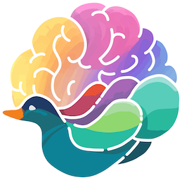
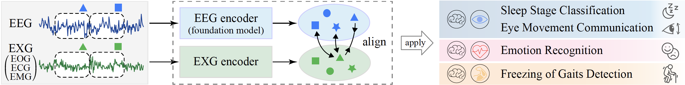

# Brant-X

  

Brant-X is the first physiological signal alignment framework that can model various physiological data like EOG, ECG and EMG. Brant-X performs knowledge transfer from EEG to other physiological signals, allowing the data and model resources in the EEG field to empower the research on other physiological signals. 

 

### Framework

#### Pipeline

Firstly, based on the EEG foundation model, the EXG encoder is trained by the alignment between synchronously collected EEG and EXG data. 
Then, the EEG and EXG encoders, capable of learning strong representations from EEG and EXG signals, are applied to various downstream tasks in diverse scenarios.

#### The foudnation model used

Brant-X employs the EEG foundation model Brant-2 as its EEG encoder to transfer the rich knowledge from the EEG foundation model to other physiological signals. 

> Zhizhang Yuan, Daoze Zhang, Junru Chen, Gefei Gu, and Yang Yang. Brant-2: Foundation Model for Brain Signals. arXiv preprint arXiv:2402.10251 (2024) [\[paper\]](https://arxiv.org/abs/2402.10251) 

 

### Review of Public Multi-type Physio-signal Datasets

To serve as a research resource for multi-type signal modeling, we summarize those public datasets that contain two or more types of signals among EEG, EOG, ECG, and EMG, as presented [here](https://github.com/DaozeZhang/Brant-X/blob/main/dataset_review_table.pdf). 

In the table, we provide statistical information including: 
- data size, 
- number of participating subjects (`#Subj.`), 
- number of channels (`#Ch.`), and 
- sampling rate (`Samp.`) for each signal, 

for researchers to reference based on their needs. 

 

### The series of works from Brant

- To establish a foundation model, we first aim to pretrain a foundation model with 500M parameters using a large amount of intracranial brain signals (*Brant*, [Zhang et al., NeurIPS'23](https://proceedings.neurips.cc/paper_files/paper/2023/hash/535915d26859036410b0533804cee788-Abstract-Conference.html)). 
- Next, we integrate EEG into the pretraining corpus, constructing a foundation model with 1B parameters, which subsequently broadens its applicability to a wider variety of downstream tasks, such as sleep staging and emotion recognition (*Brant-2*, [Yuan et al., arXiv](https://arxiv.org/abs/2402.10251)). 
- Leveraging the powerful generalization capabilities of Brant-2, we propose a unified alignment framework (*Brant-X*, Zhang et al., KDD'24) for direct adaptation of Brant-2 to downstream tasks that involve rare physiological signals like EOG, ECG, and EMG.
- In prospect, we wish to push the boundaries of what's possible in "AI + neuroscience/medicine", propelled by our belief in the potential of these models to contribute to the advancement of human health and well-being.
